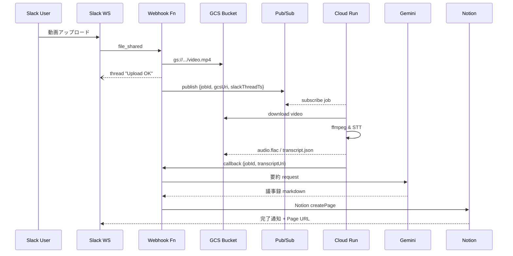

# 詳細設計書（ドラフト v0.1）

---

## 1  ドキュメント情報

| 項目 | 内容 |
| --- | --- |
| 文書バージョン | v0.1（初版） |
| 作成日 | 2025-05-13 |
| 作成者 | 開発リーダー |
| 対象システム | 議事録作成ツール |
| 上位文書 | 要件定義書（ドラフト v0.3） |

---

## 2  システム構成詳細

### 2.1  コンポーネント一覧

| コンポーネント | ランタイム / サービス | 主な責務 |
| --- | --- | --- |
| Webhook Server | Next.js API（Vercel Fn） | Slack イベント受信、GCS 転送、Pub/Sub Publish、Gemini／Notion 呼び出し、Slack 返信 |
| Cloud Run Job | Container (Alpine + ffmpeg + gcloud) | 動画→音声変換、Speech-to-Text、GCS へ成果物 PUT、Webhook Server へ Callback |
| Gemini API | Google Generative AI | 文字起こし結果から 7 セクション要約生成 |
| Notion API | Notion Database | 議事録ページ作成、更新 |
| Pub/Sub | Cloud Pub/Sub | Cloud Run Job 起動トリガー用メッセージバス |
| GCS | Cloud Storage | 動画 / 音声 / Transcript ファイル保管 |
| Slack | Slack API | ユーザー通知チャネル |

### 2.2  デプロイ構成図

```mermaid
flowchart TD
  subgraph UserDomain
    SlackClient[Slack ユーザー]-->|Upload Video|SlackWS[Slack Workspace]
  end
  subgraph Vercel
    Webhook[Webhook Server]
  end
  subgraph GCP
    GCS[(GCS Bucket)]
    PubSub((Pub/Sub Topic))
    Run[Cloud Run Job]
    Gemini[Gemini API]
    NotionDB[(Notion DB)]
  end
  SlackWS-->|file_shared|Webhook
  Webhook-->|Secure Copy|GCS
  Webhook-->|Publish(jobMsg)|PubSub
  PubSub-->|Trigger|Run
  Run-->|Audio/Transcript|GCS
  Run-->|Callback|Webhook
  Webhook-->|Summarize|Gemini
  Webhook-->|Create Page|NotionDB
  NotionDB-->|Page URL|SlackWS
```

---

## 3  データフロー詳細

### 3.1  正常シーケンス



### 3.2  Pub/Sub メッセージフォーマット（JSON Schema）

```json
{
  "jobId": "string (UUID)",
  "videoGcsUri": "string (gs://...)",
  "fileId": "string (Slack file_id)",
  "threadTs": "string (Slack thread_ts)",
  "uploadedAt": "string (ISO 8601)"
}
```

---

## 4  API 仕様

### 4.1  Webhook Server エンドポイント

| No | API | Method | 認証 | 概要 |
| -- | --- | --- | --- | --- |
| 1 | /api/slack/events | POST | Slack Signing Secret | file_shared, file_public events を受信 |
| 2 | /api/jobs/callback | POST | Cloud Run Bearer | Cloud Run 完了コールバック受信 |

#### 4.1.1  /api/slack/events

* Request: Slack Event API payload
* Response: 200 OK (challenge 対応含む)
* 主処理: file_shared 受信時に ① GCS コピー ② Upload OK ③ Pub/Sub Publish

#### 4.1.2  /api/jobs/callback

| フィールド | 型 | 必須 | 説明 |
| --- | --- | --- | --- |
| jobId | string | ✓ | Pub/Sub と一致 |
| transcriptUri | string | ✓ | gs:// path |
| durationSec | number | | 変換時間 |

### 4.2  Cloud Run Job

* Container Entrypoint: `./entrypoint.sh`
* Env:
  * `JOB_ID`, `VIDEO_GCS_URI`, `OUTPUT_PREFIX`, `CALLBACK_URL`
* Exit Codes: 0=Success, 10=FFmpeg Error, 20=STT Error

### 4.3  Gemini Prompt

```
あなたは優秀な議事録作成アシスタントです。以下の JSON 文字起こし結果を読み取り、7 セクションの議事録を Markdown 形式で生成してください。
<JSON>::{transcript}
```

### 4.4  Notion DB への POST

| プロパティ | 型 | 値例 |
| --- | --- | --- |
| Title | title | "2025/05/13 顧客A定例" |
| 会議の基本情報 | rich_text | "2025/05/13\nコンサル:山田\nクライアント:ABC 株式会社" |
| Transcript_URL | url | https://storage.googleapis.com/... |
| Status | select | Draft / Done / Error |

---

## 5  データモデル

### 5.1  GCS オブジェクトパス

```
meetings/{yyyyMMdd_HHmmss}_{fileId}/video.mp4
meetings/{yyyyMMdd_HHmmss}_{fileId}/audio.flac
meetings/{yyyyMMdd_HHmmss}_{fileId}/transcript.json
```

### 5.2  Notion DB スキーマ

| プロパティ | 型 | 必須 | 備考 |
| --- | --- | --- | --- |
| 会議名 | title | ✓ | Slack メッセージ本文 or FR-05 要約タイトル |
| Status | select | ✓ | 初期 Draft、完了 Done、失敗 Error |
| 会議の基本情報～その他特記事項 | rich_text | ✓ | 7 セクション |
| Transcript_URL | url | ✓ | 文字起こし JSON |
| Video_URL | url | | 元動画 |

---

## 6  エラーハンドリング & リトライ

| フェーズ | 想定エラー | リトライ回数 / 間隔 | フォールバック |
| --- | --- | --- | --- |
| Slack 受信 | Event 署名不一致 | 0 | 400 応答 & ログ |
| GCS コピー | NetworkError | 3 回 / 5s | Error Slack 通知 |
| Cloud Run | Job Timeout | 2 回 / 10m | ジョブ分割 TODO |
| Gemini | RateLimit | 5 回 / exp backoff | 失敗時 Error ステータス |
| Notion | 429 TooManyRequests | 3 回 / 1m | 失敗時 Error ステータス |

---

## 7  セキュリティ設計

1. IAM ロール一覧（抜粋）
   * Webhook Server SA: `roles/storage.objectCreator`, `roles/pubsub.publisher`
   * Cloud Run SA: `roles/storage.objectAdmin`, `roles/iam.serviceAccountTokenCreator`
2. OAuth スコープ
   * Slack: `files:read`, `chat:write`, `chat:write.public`, `chat:write.customize`
   * Notion: `databases.read`, `databases.write`, `pages.write`
3. Secret 管理: Vercel Environment Secrets / Secret Manager (GCP) で各キー暗号化保存
4. データ保護: GCS CMEK (オプション) + HTTPS / TLS1.2+

---

## 8  運用設計

* **監視**: Cloud Monitoring Log-based メトリクス → アラート → Slack #alert
* **ダッシュボード**: Uptime (Webhook), Job Success Rate, 平均処理時間
* **バックアップ**: Notion DB 週次エクスポート → GCS
* **スケーリング**: Cloud Run Max Instances=10, Concurrency=1

---

## 9  テスト計画

| テスト種別 | 対象 | ツール | 完了基準 |
| --- | --- | --- | --- |
| 単体テスト | Webhook Fn, Cloud Run | Jest, PyTest | カバレッジ 80% |
| 結合テスト | Slack→Notion E2E | Postman/Newman | NFR-01 SLA 内完了 |
| 耐障害テスト | Cloud Run 強制 kill | Manual | リトライで復旧 |

---

## 10  コスト試算（月次）

| サービス | 数量想定 | 単価 | 月額目安 |
| --- | --- | --- | --- |
| Cloud Run | 50 job × 10 分 | $0.000024 / vCPU-s | $3 |
| GCS Storage | 100 GB | $0.026 / GB | $2.6 |
| Speech-to-Text | 500 分 | $0.024 / 分 | $12 |
| Gemini API | 500K tokens | TBD | $15（概算） |
| Notion API | N/A | 無償 | $0 |
| 合計 | | | ≈ $33.6 |

---

## 11  スケジュール詳細（WBS 抜粋）

| タスク | 期間 | 担当 |
| --- | --- | --- |
| 詳細設計レビュー | 5/13–5/17 | 全員 |
| 開発（Webhook） | 5/20–6/03 | BE チーム |
| 開発（Cloud Run） | 5/20–6/03 | BE チーム |
| 結合テスト | 6/04–6/14 | QA |
| UAT | 6/17–6/24 | クライアント |
| MVP リリース | 6/30 | — |

---

## 12  付録

* Mermaid ソースファイル
* Gemini Prompt サンプル
* API スキーマ定義 (OpenAPI 3.1) 